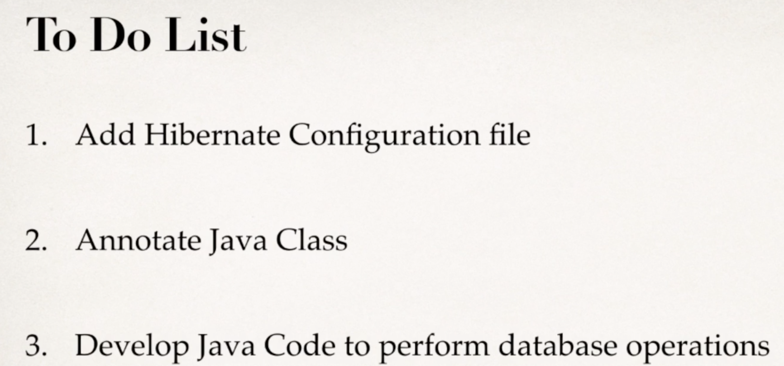
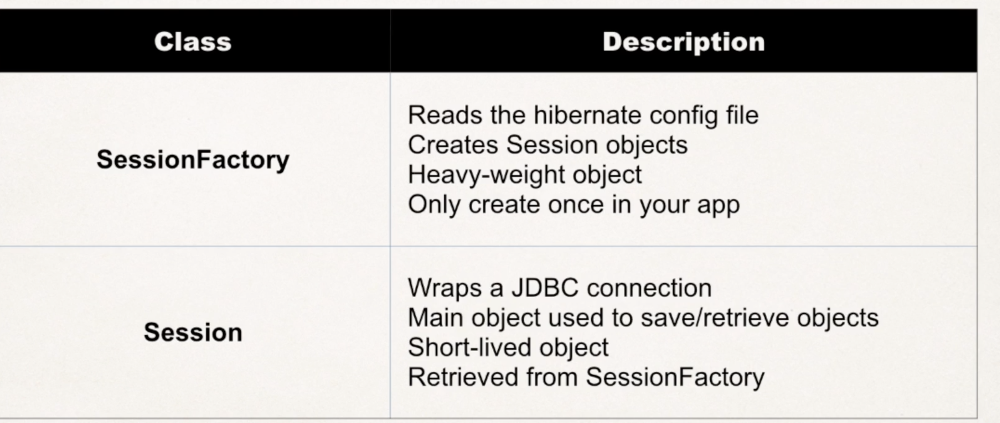

# Hibernate

## 配置环境

1. 下载Hibernate的jar包

    hibernate.org

2. 将hibernate的jar包放到项目的lib里面


*注意*：如果使用java 9以上的版本，Hibernate遇到问题可以去[这里](../FAQ/Section%2020%20-%20Hibernate%20Configuration%20with%20Annotations/182-heads-up-for-java-9-users.pdf)
## 配置流程

  

## 配置文件
``` xml
<!DOCTYPE hibernate-configuration PUBLIC
        "-//Hibernate/Hibernate Configuration DTD 3.0//EN"
        "http://www.hibernate.org/dtd/hibernate-configuration-3.0.dtd">

<hibernate-configuration>

    <session-factory>

        <!-- JDBC Database connection settings -->
        <property name="connection.driver_class">com.mysql.cj.jdbc.Driver</property>
        <property name="connection.url">jdbc:mysql://localhost:3306/hb_student_tracker?useSSL=false&amp;serverTimezone=UTC</property>
        <property name="connection.username">hbstudent</property>
        <property name="connection.password">hbstudent</property>

        <!-- JDBC connection pool settings ... using built-in test pool -->
        <property name="connection.pool_size">1</property>

        <!-- Select our SQL dialect 每一个sql语言都与标准不太一样，所以需要调整使用的SQL server -->
        <property name="dialect">org.hibernate.dialect.MySQLDialect</property>

        <!-- Echo the SQL to stdout -->
        <property name="show_sql">true</property>

		<!-- Set the current session context -->
		<property name="current_session_context_class">thread</property>
 
    </session-factory>

</hibernate-configuration>
```

## Hibernate Mapping 配置

### *Terminology*
*Entity class*: 使用Hibernate map到database的class

### *XML configuration*
Legacy, 现在基本不用了

### *Annotaton Configuration*

*步骤*
``` java
package com.luv2code.hibernate.demo.entity;

// (*1)
import javax.persistence.Column;
import javax.persistence.Entity;
import javax.persistence.GeneratedValue;
import javax.persistence.GenerationType;
import javax.persistence.Id;
import javax.persistence.Table;

// 1. 将class map到database table中
@Entity
@Table(name="student")
public class Student {

// 2. 将class中的field map到table中
	@Id //注释表明primary key
	@GeneratedValue(strategy=GenerationType.IDENTITY) 
	@Column(name="id") // colunm的名字
	private int id;
	
	@Column(name="first_name")
	private String firstName;
	
	@Column(name="last_name")
	private String lastName;
	
	@Column(name="email")
	private String email;
	
	public Student() {
		
	}

	public Student(String firstName, String lastName, String email) {
		this.firstName = firstName;
		this.lastName = lastName;
		this.email = email;
	}

	public int getId() {
		return id;
	}

	public void setId(int id) {
		this.id = id;
	}

	public String getFirstName() {
		return firstName;
	}

	public void setFirstName(String firstName) {
		this.firstName = firstName;
	}

	public String getLastName() {
		return lastName;
	}

	public void setLastName(String lastName) {
		this.lastName = lastName;
	}

	public String getEmail() {
		return email;
	}

	public void setEmail(String email) {
		this.email = email;
	}

	@Override
	public String toString() {
		return "Student [id=" + id + ", firstName=" + firstName + ", lastName=" + lastName + ", email=" + email + "]";
	}
}
```
*注意*:

colunm name和primative值的名字不一定需要一样。如果不填写就默认使用primitive的名字当作colunm的名字

*问题*：

* [如何使用java code配置hibernate？](https://www.dineshonjava.com/hibernate/hbm2ddl-configuration-and-name/)

*注释*：

 1. [为什么使用Hibernate的Annotation？](../FAQ/Section%2020%20-%20Hibernate%20Configuration%20with%20Annotations/185-faq-why-we-are-using-jpa-annotation-instead-of-hibernate.pdf)


## Session factory 和 Session
  

## 开发一个hibernate应用的步骤

1. 配置并定义好hibernate的entity (同上j)
2. 在main funciton里调用
    ``` java
    	public static void main(String[] args) {
        
    		// create session factory
    		SessionFactory factory = new Configuration()
    								.configure("hibernate.cfg.xml")
    								.addAnnotatedClass(Student.class)
    								.buildSessionFactory();
    		// create session
    		Session session = factory.getCurrentSession();
    
    		try {			
    			// create a student object
    			System.out.println("Creating new student object...");
    			Student tempStudent = new Student("Paul", "Doe", "paul@luv2code.com");
    
    			// start a transaction
    			session.beginTransaction();
    
    			// save the student object
    			System.out.println("Saving the student...");
    			session.save(tempStudent);
    
    			// commit transaction
    			session.getTransaction().commit();
    
    			System.out.println("Done!");
    		}
    		finally {
    			factory.close();
    		}
    	}
    ```