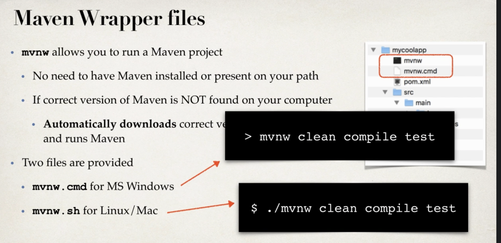

# Springboot 项目结构

## 在命令行使用Springboot

可以使用springboot中的mvnw来运行`mvn package`，将Springboot项目打包为jar（包含tomcat，可以直接运行）。如果已经安装mvnw，则可以直接运行`mvn package`

在打包完项目之后，可以使用

``` bash
java -jar
```

来运行程序

如果springboot有安装`spring-boot-maven-plugin`，则可以直接使用

``` bash
mvn springboot:run
```

来运行


文件代码存放位置

  

maven wrapper file

  

## Spring actuator

我们可以在dependency中加入actuator来查看app的情况，加入spring security的dependency会自动将actuator除health和info之外的信息用security保护起来

## Property injection

在配置app的时候，我们会需要使用application.properties来注入一些配置的值。springboot中，我们可以使用`@Value`来注入。如果


## 配置springboot
在`application.properties`中，我们可以配置springboot，一下是一些常用配置：

不同包的Logging level:

  

